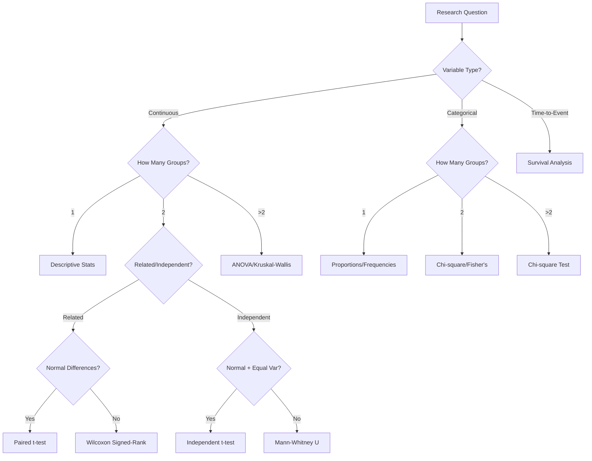
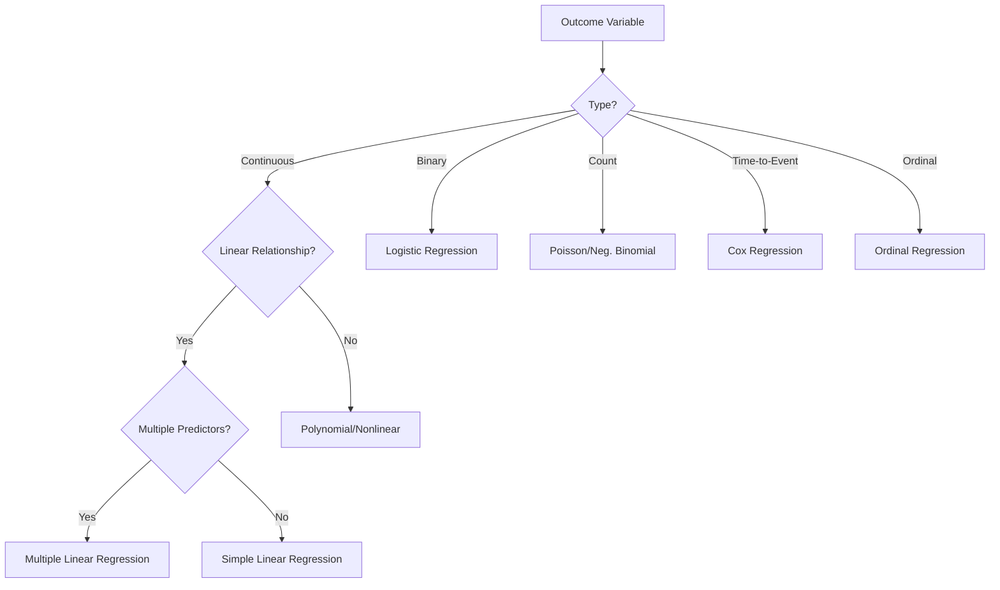
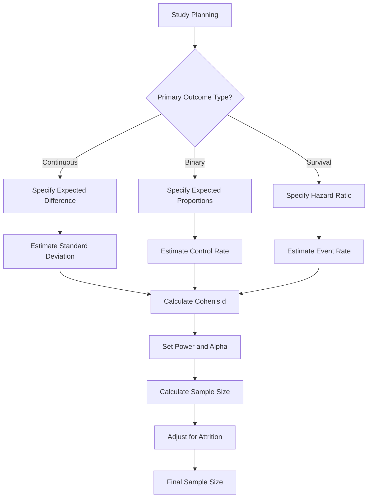

# Statistical Analysis Decision Tree Guide
## For Medical and Scientific Research

### Version 1.0 | August 2025

---

## Table of Contents
1. [Overview](#overview)
2. [Study Design Classification](#study-design-classification)
3. [Variable Type Identification](#variable-type-identification)
4. [Descriptive Statistics Decision Tree](#descriptive-statistics-decision-tree)
5. [Inferential Statistics Decision Tree](#inferential-statistics-decision-tree)
6. [Effect Size Selection Guide](#effect-size-selection-guide)
7. [Power Analysis Guidelines](#power-analysis-guidelines)
8. [Multiple Comparisons Corrections](#multiple-comparisons-corrections)
9. [Assumption Checking Protocols](#assumption-checking-protocols)
10. [Reporting Standards](#reporting-standards)
11. [Common Mistakes to Avoid](#common-mistakes-to-avoid)
12. [Quick Reference Flowcharts](#quick-reference-flowcharts)

---

## Overview

This guide provides a systematic approach to selecting appropriate statistical methods for medical and scientific research. Follow the decision trees to ensure rigorous and appropriate statistical analysis.

### Key Principles
- **Match the analysis to the research question**
- **Check assumptions before testing**
- **Report effect sizes and confidence intervals**
- **Consider clinical significance alongside statistical significance**
- **Document all analytical decisions**

---

## Study Design Classification

### Primary Study Designs

#### Experimental Studies
- **Randomized Controlled Trial (RCT)**
  - Gold standard for causal inference
  - Random allocation to treatments
  - Control group present
  - Blinding when possible

- **Quasi-Experimental**
  - Non-random allocation
  - Control group may be present
  - Natural experiments

#### Observational Studies
- **Cohort Study**
  - Follow subjects over time
  - Prospective or retrospective
  - Calculate incidence rates

- **Case-Control Study**
  - Compare cases to controls
  - Retrospective design
  - Calculate odds ratios

- **Cross-Sectional Study**
  - Single time point
  - Prevalence studies
  - Survey research

### Analysis Implications by Study Design

| Study Design | Primary Analysis | Effect Measures | Special Considerations |
|---|---|---|---|
| RCT | Intention-to-treat analysis | Risk difference, RR, OR | Randomization balance, compliance |
| Cohort | Risk/rate comparison | RR, Hazard ratios | Confounding control, loss to follow-up |
| Case-Control | Exposure comparison | Odds ratios | Recall bias, matching considerations |
| Cross-sectional | Prevalence comparison | OR, correlation | Temporal relationships unclear |

---

## Variable Type Identification

### Decision Tree: Variable Classification

```
Is the variable measured numerically?
│
├─ YES → Is it meaningful to calculate means?
│  │
│  ├─ YES → Is there a natural zero point?
│  │  │
│  │  ├─ YES → **RATIO SCALE** (e.g., age, weight, blood pressure)
│  │  └─ NO → **INTERVAL SCALE** (e.g., temperature in Celsius)
│  │
│  └─ NO → **DISCRETE/COUNT** (e.g., number of episodes, family size)
│
└─ NO → Does the variable have a natural order?
   │
   ├─ YES → **ORDINAL** (e.g., pain scale, disease severity)
   └─ NO → **NOMINAL/CATEGORICAL** (e.g., gender, blood type)
```

### Variable Type Examples in Medical Research

#### Continuous Variables
- **Normally Distributed**: Age, height, blood pressure (systolic/diastolic), BMI
- **Non-Normal**: Hospital length of stay, cost data, biomarker levels
- **Time-to-Event**: Survival time, time to recovery, disease-free interval

#### Categorical Variables
- **Binary**: Gender (M/F), disease status (Yes/No), mortality (Dead/Alive)
- **Nominal**: Blood type (A/B/AB/O), treatment arm (A/B/C), ethnicity
- **Ordinal**: Pain scale (0-10), NYHA class (I-IV), Likert scales

---

## Descriptive Statistics Decision Tree

### For Continuous Variables

```
Start: Continuous Variable
│
├─ Check Distribution
│  │
│  ├─ NORMAL DISTRIBUTION
│  │  ├─ Report: Mean ± SD
│  │  ├─ Report: 95% CI for mean
│  │  └─ Consider: Range, median for completeness
│  │
│  └─ NON-NORMAL DISTRIBUTION
│     ├─ Report: Median [IQR] or Median (Q1, Q3)
│     ├─ Report: Range (min, max)
│     ├─ Consider: Mean ± SD if clinically meaningful
│     └─ Visual: Histogram or box plot recommended
│
└─ Always Report
   ├─ Sample size (n)
   ├─ Missing values
   └─ Outliers (if present)
```

### For Categorical Variables

```
Start: Categorical Variable
│
├─ BINARY VARIABLE
│  ├─ Report: n (%)
│  ├─ Calculate: 95% CI for proportion (Wilson method)
│  └─ Consider: Risk/prevalence context
│
└─ MULTI-CATEGORY VARIABLE
   ├─ Report: n (%) for each category
   ├─ Calculate: 95% CI for each proportion
   ├─ Order: By frequency or logical order
   └─ Consider: Combining rare categories (if >5 categories)
```

### Normality Testing Protocol

1. **Visual Assessment** (Primary)
   - Histogram with normal overlay
   - Q-Q plot
   - Box plot for outliers

2. **Statistical Tests** (Secondary)
   - **Shapiro-Wilk**: n < 50
   - **Kolmogorov-Smirnov**: n ≥ 50
   - **Anderson-Darling**: More sensitive to tails

3. **Decision Rules**
   - **Normal if**: Visual assessment suggests normality AND p > 0.05
   - **Non-normal if**: Clear visual deviation OR p ≤ 0.05
   - **Borderline**: Use non-parametric methods (conservative approach)

---

## Inferential Statistics Decision Tree

### Two-Group Comparisons

```
Two Groups to Compare
│
├─ CONTINUOUS OUTCOME
│  │
│  ├─ Independent Groups?
│  │  │
│  │  ├─ YES (Independent Samples)
│  │  │  │
│  │  │  ├─ Normal Distribution + Equal Variances?
│  │  │  │  │
│  │  │  │  ├─ YES → Independent t-test
│  │  │  │  └─ NO → Welch's t-test OR Mann-Whitney U
│  │  │  │
│  │  │  └─ Sample Size < 30 or Non-Normal?
│  │  │     └─ YES → Mann-Whitney U test
│  │  │
│  │  └─ NO (Paired/Dependent Groups)
│  │     │
│  │     ├─ Normal Differences? → Paired t-test
│  │     └─ Non-Normal Differences? → Wilcoxon Signed-Rank
│  │
│  └─ Check Effect Size: Cohen's d
│
└─ CATEGORICAL OUTCOME
   │
   ├─ 2×2 Table
   │  │
   │  ├─ Expected frequencies ≥ 5? → Chi-square test
   │  ├─ Expected frequencies < 5? → Fisher's Exact test
   │  └─ Effect Size: Odds Ratio, Relative Risk
   │
   └─ Larger Tables
      │
      ├─ Chi-square test of independence
      └─ Effect Size: Cramer's V
```

### Multiple Group Comparisons

```
Multiple Groups (>2)
│
├─ CONTINUOUS OUTCOME
│  │
│  ├─ Normal Distribution + Equal Variances?
│  │  │
│  │  ├─ YES → One-Way ANOVA
│  │  │  └─ If significant → Post-hoc tests (Tukey HSD)
│  │  │
│  │  └─ NO → Kruskal-Wallis test
│  │     └─ If significant → Dunn's post-hoc test
│  │
│  └─ Multiple Factors?
│     │
│     ├─ Two-Way ANOVA (if assumptions met)
│     └─ Check interactions
│
└─ CATEGORICAL OUTCOME
   │
   ├─ Chi-square test of independence
   └─ If significant → Adjusted residuals or Bonferroni correction
```

### Advanced Analysis Selection

#### Regression Analysis Decision Tree

```
Regression Analysis Needed?
│
├─ CONTINUOUS OUTCOME
│  │
│  ├─ Linear relationship? → Linear Regression
│  ├─ Non-linear relationship? → Polynomial/Non-linear Regression
│  └─ Multiple predictors? → Multiple Linear Regression
│
├─ BINARY OUTCOME
│  │
│  └─ Logistic Regression
│
├─ COUNT OUTCOME
│  │
│  └─ Poisson Regression (or Negative Binomial)
│
├─ TIME-TO-EVENT OUTCOME
│  │
│  ├─ Simple survival curves → Kaplan-Meier
│  ├─ Group comparisons → Log-rank test
│  └─ Multiple predictors → Cox Proportional Hazards
│
└─ ORDINAL OUTCOME
   │
   └─ Ordinal Regression (Proportional Odds Model)
```

---

## Effect Size Selection Guide

### By Analysis Type

| Analysis Type | Primary Effect Size | Interpretation | Alternative Measures |
|---|---|---|---|
| **Independent t-test** | Cohen's d | 0.2 small, 0.5 medium, 0.8 large | Glass's Δ, Hedges' g |
| **Paired t-test** | Cohen's d (paired) | Same interpretation | Correlation coefficient |
| **Mann-Whitney U** | r = Z/√N | 0.1 small, 0.3 medium, 0.5 large | η² |
| **Chi-square (2×2)** | Odds Ratio, Relative Risk | Context dependent | φ coefficient |
| **Chi-square (larger)** | Cramer's V | 0.1 small, 0.3 medium, 0.5 large | Contingency coefficient |
| **ANOVA** | η² (eta-squared) | 0.01 small, 0.06 medium, 0.14 large | ω² (omega-squared) |
| **Correlation** | Pearson's r or Spearman's ρ | 0.1 small, 0.3 medium, 0.5 large | R² for explained variance |

### Medical Context Considerations

#### Odds Ratio Interpretation
- **OR = 1**: No association
- **OR > 1**: Increased odds (risk factor)
- **OR < 1**: Decreased odds (protective factor)
- **OR ≥ 2 or ≤ 0.5**: Often considered clinically meaningful

#### Relative Risk Interpretation
- **RR = 1**: No increased risk
- **RR > 1**: Increased risk
- **RR < 1**: Decreased risk (protective)
- **Consider baseline risk** for clinical interpretation

#### Number Needed to Treat (NNT)
```
NNT = 1 / (Risk_control - Risk_treatment)
```
- Lower NNT = more effective treatment
- NNT = 2-5: Very effective
- NNT = 5-10: Moderately effective
- NNT > 10: Less effective (context dependent)

---

## Power Analysis Guidelines

### When to Perform Power Analysis

#### A Priori (Before Study)
- **Required for**: Grant applications, protocol development
- **Calculate**: Required sample size
- **Specify**: Effect size, power (usually 80% or 90%), alpha (usually 0.05)

#### Post-Hoc (After Study)
- **Purpose**: Interpret non-significant results
- **Calculate**: Achieved power given observed effect size
- **Avoid**: Using post-hoc power to justify results

### Sample Size Calculation Steps

1. **Define Primary Outcome**
2. **Specify Effect Size**
   - Clinical significance threshold
   - Previous literature
   - Pilot study data
3. **Set Parameters**
   - Power: 80% (0.8) or 90% (0.9)
   - Alpha: 0.05 (two-tailed) or 0.025 (one-tailed)
   - Allocation ratio (usually 1:1)
4. **Account for Attrition**
   - Expected dropout rate
   - Inflate sample size accordingly
5. **Consider Design Effects**
   - Clustering (design effect)
   - Matching or stratification

### Sample Size Tables (Quick Reference)

#### Independent t-test (Equal groups, α=0.05, Power=80%)

| Effect Size (Cohen's d) | Total Sample Size | Per Group |
|---|---|---|
| 0.2 (Small) | 788 | 394 |
| 0.3 | 352 | 176 |
| 0.5 (Medium) | 128 | 64 |
| 0.8 (Large) | 52 | 26 |
| 1.0 | 34 | 17 |

#### Proportions Test (Equal groups, α=0.05, Power=80%)

| Control % | Treatment % | Difference | Total N |
|---|---|---|---|
| 20% | 30% | 10% | 788 |
| 30% | 40% | 10% | 870 |
| 40% | 50% | 10% | 960 |
| 50% | 60% | 10% | 1004 |
| 20% | 40% | 20% | 198 |
| 30% | 50% | 20% | 218 |

---

## Multiple Comparisons Corrections

### When Correction is Needed

#### **Correction Required**
- Multiple primary endpoints
- Multiple treatment arms vs. control
- Multiple subgroup analyses (planned)
- Multiple time points (repeated testing)
- Family of related hypotheses

#### **Correction May Not Be Needed**
- Single primary hypothesis
- Exploratory/descriptive analyses
- Secondary/safety endpoints (with proper labeling)
- Hypothesis-generating research

### Correction Methods

#### **Bonferroni Correction**
- **Adjusted α** = 0.05 / number of comparisons
- **Conservative** but easy to apply
- **Use when**: Few comparisons (<10)

#### **Holm-Bonferroni (Step-Down)**
- **Less conservative** than Bonferroni
- **Procedure**: Order p-values, test sequentially
- **Recommended** over simple Bonferroni

#### **False Discovery Rate (FDR)**
- **Benjamini-Hochberg procedure**
- **Less conservative** than family-wise methods
- **Use when**: Many comparisons (e.g., genomics)

#### **Tukey HSD**
- **Specific to** ANOVA post-hoc tests
- **Controls** family-wise error rate
- **Use after** significant ANOVA F-test

### Decision Matrix

| Number of Comparisons | Primary Analysis | Recommended Method |
|---|---|---|
| 2-5 | Yes | Bonferroni or Holm-Bonferroni |
| 6-20 | Yes | Holm-Bonferroni |
| >20 | Yes | FDR (Benjamini-Hochberg) |
| Any | No (Exploratory) | Report unadjusted p-values with caveat |
| Post-hoc after ANOVA | Yes | Tukey HSD |

---

## Assumption Checking Protocols

### Parametric Test Assumptions

#### **Normality**
```
Visual Checks:
├─ Histogram with normal overlay
├─ Q-Q (quantile-quantile) plot
└─ Box plot for outliers

Statistical Tests:
├─ Shapiro-Wilk test (n < 50)
├─ Kolmogorov-Smirnov test (n ≥ 50)
└─ Anderson-Darling test (sensitive to tails)

Decision:
├─ Normal if: Good visual fit AND p > 0.05
├─ Non-normal if: Poor visual fit OR p ≤ 0.05
└─ Borderline: Use non-parametric (conservative)
```

#### **Homogeneity of Variance**
```
For Independent t-test:
├─ Levene's test (robust to non-normality)
├─ F-test (assumes normality)
└─ Rule of thumb: Ratio of variances < 4:1

For ANOVA:
├─ Levene's test
├─ Bartlett's test (sensitive to non-normality)
└─ Brown-Forsythe test (robust alternative)

Decision:
├─ Equal variances if: p > 0.05
└─ Unequal variances if: p ≤ 0.05 → Use Welch's correction
```

#### **Independence**
- **Check**: Study design and data collection
- **Violations**: Clustered data, repeated measures, matched pairs
- **Solutions**: Mixed models, GEE, or cluster-robust standard errors

#### **Linearity** (for regression)
```
Visual Checks:
├─ Scatterplot of Y vs. X
├─ Residual plots
└─ Component-plus-residual plots

Statistical Tests:
├─ Rainbow test
└─ Harvey-Collier test

Solutions for Non-linearity:
├─ Transform variables
├─ Add polynomial terms
└─ Use non-parametric regression
```

### What to Do When Assumptions Are Violated

| Assumption Violated | Options |
|---|---|
| **Normality** | 1. Non-parametric test<br>2. Transform data (log, sqrt)<br>3. Bootstrap methods<br>4. Robust statistics |
| **Equal Variances** | 1. Welch's t-test<br>2. Non-parametric test<br>3. Transform data<br>4. Permutation test |
| **Independence** | 1. Mixed-effects models<br>2. Generalized Estimating Equations<br>3. Cluster-robust SE<br>4. Account for clustering in design |
| **Linearity** | 1. Transform variables<br>2. Add polynomial terms<br>3. Spline regression<br>4. Non-parametric regression |

---

## Reporting Standards

### CONSORT for RCTs

#### **Essential Elements**
- **Flow diagram**: Enrollment, allocation, follow-up, analysis
- **Baseline table**: Participant characteristics by group
- **Primary outcome**: Pre-specified analysis plan
- **Effect estimates**: Point estimate and confidence interval
- **P-values**: Exact values, not just "p < 0.05"

### STROBE for Observational Studies

#### **Essential Elements**
- **Study design**: Clear identification in title/abstract
- **Participants**: Selection criteria and recruitment
- **Variables**: Clear definitions and measurement methods
- **Statistical methods**: Detailed description including software
- **Results**: Numbers analyzed, missing data, effect estimates

### Statistical Reporting Checklist

#### **Descriptive Statistics**
- [ ] Sample sizes for all groups
- [ ] Missing data patterns and handling
- [ ] Measures of central tendency and spread
- [ ] Confidence intervals for key estimates

#### **Inferential Statistics**
- [ ] Pre-specified statistical plan
- [ ] Assumption checking and handling violations
- [ ] Exact p-values (not just thresholds)
- [ ] Effect sizes with confidence intervals
- [ ] Multiple comparison corrections (if applicable)

#### **Figures and Tables**
- [ ] Clear, self-explanatory legends
- [ ] Error bars specified (SE, SD, or CI)
- [ ] Sample sizes indicated
- [ ] Statistical significance marked appropriately

### P-Value Reporting Guidelines

#### **Preferred Format**
- **Exact values**: p = 0.032, not p < 0.05
- **Very small**: p < 0.001 (not p = 0.000)
- **Non-significant**: p = 0.18, not "NS" or "n.s."
- **Trend**: Avoid "trend toward significance"

#### **Avoid These Phrases**
- ❌ "Marginally significant" (p = 0.06)
- ❌ "Nearly significant" (p = 0.08)
- ❌ "Trending toward significance" (p = 0.12)
- ✅ "Not statistically significant" (p = 0.06)

---

## Common Mistakes to Avoid

### Design and Analysis Mistakes

#### **1. Multiple Testing Without Correction**
- **Problem**: Testing many hypotheses increases Type I error
- **Solution**: Pre-specify primary endpoints, apply appropriate corrections
- **Example**: Testing 10 biomarkers without correction gives ~40% chance of false positive

#### **2. Post-Hoc Power Analysis**
- **Problem**: Using observed effect size to calculate power
- **Solution**: Focus on confidence intervals and effect sizes for interpretation
- **Why problematic**: Always gives low power for non-significant results

#### **3. P-Hacking**
- **Problem**: Trying multiple analyses until finding significance
- **Examples**: 
  - Testing multiple endpoints until one is significant
  - Trying different subgroups
  - Removing "outliers" to get significance
- **Prevention**: Pre-registered analysis plan

#### **4. Confusing Statistical and Clinical Significance**
- **Problem**: Assuming statistical significance equals clinical importance
- **Solution**: Always interpret effect sizes in clinical context
- **Example**: Statistically significant 0.1 mmHg BP reduction may not be clinically meaningful

### Statistical Test Selection Errors

#### **1. Using t-test Instead of ANOVA**
- **Wrong**: Multiple t-tests between groups (increases Type I error)
- **Right**: ANOVA followed by post-hoc tests if significant

#### **2. Ignoring Assumption Violations**
- **Problem**: Using parametric tests when assumptions clearly violated
- **Solution**: Check assumptions, use appropriate alternatives

#### **3. Inappropriate Use of Chi-Square**
- **Problem**: Using chi-square with expected frequencies < 5
- **Solution**: Use Fisher's exact test or combine categories

### Interpretation Mistakes

#### **1. Correlation vs. Causation**
- **Problem**: Assuming correlation implies causation
- **Example**: "Coffee consumption prevents Parkinson's disease"
- **Reality**: Need experimental evidence or careful causal inference methods

#### **2. Base Rate Neglect**
- **Problem**: Ignoring prevalence when interpreting diagnostic tests
- **Example**: 95% sensitive test in low-prevalence disease still gives many false positives
- **Solution**: Calculate predictive values considering prevalence

#### **3. Extrapolating Beyond Data**
- **Problem**: Applying results to populations not studied
- **Example**: Generalizing from highly selected trial participants to general population

---

## Quick Reference Flowcharts

### Flowchart 1: Initial Analysis Decision



### Flowchart 2: Regression Analysis Decision



### Flowchart 3: Sample Size Planning



---

## Software-Specific Implementation Notes

### R Commands
```r
# Descriptive statistics
summary(data$variable)
psych::describe(data$variable)

# Tests
t.test(group1, group2)                    # Independent t-test
t.test(before, after, paired=TRUE)       # Paired t-test
wilcox.test(group1, group2)              # Mann-Whitney
chisq.test(table(var1, var2))           # Chi-square

# Effect sizes
effsize::cohen.d(group1, group2)         # Cohen's d
```

### Python (with medical_stats_toolkit)
```python
from medical_stats_toolkit import *

# Descriptive statistics
desc_stats = DescriptiveStatistics.summary_statistics(data)

# Hypothesis tests
t_result = HypothesisTests.t_test_independent(group1, group2)
chi2_result = HypothesisTests.chi_square_test(contingency_table)

# Effect sizes
cohens_d = EffectSizes.cohens_d(group1, group2)
```

### SPSS Menu Paths
- **Descriptive Statistics**: Analyze → Descriptive Statistics → Descriptives
- **Independent t-test**: Analyze → Compare Means → Independent-Samples T Test
- **Chi-square**: Analyze → Descriptive Statistics → Crosstabs
- **ANOVA**: Analyze → General Linear Model → Univariate

---

## Conclusion

This statistical decision guide provides a systematic approach to statistical analysis in medical research. Key principles to remember:

1. **Plan your analysis before collecting data**
2. **Match your statistical method to your research question and data type**
3. **Always check assumptions and report violations**
4. **Report effect sizes and confidence intervals, not just p-values**
5. **Consider clinical significance alongside statistical significance**
6. **Document all analytical decisions for transparency and reproducibility**

For complex studies or novel analytical challenges, consult with a statistician early in the study design phase.

---

**Document Information:**
- **Version**: 1.0
- **Last Updated**: August 2025
- **Prepared by**: Medical Statistics Toolkit Team
- **License**: Open source for academic and research use

**Recommended Citation:**
Medical Statistics Toolkit Team. (2025). Statistical Analysis Decision Tree Guide for Medical and Scientific Research, Version 1.0. Available at: [repository URL]